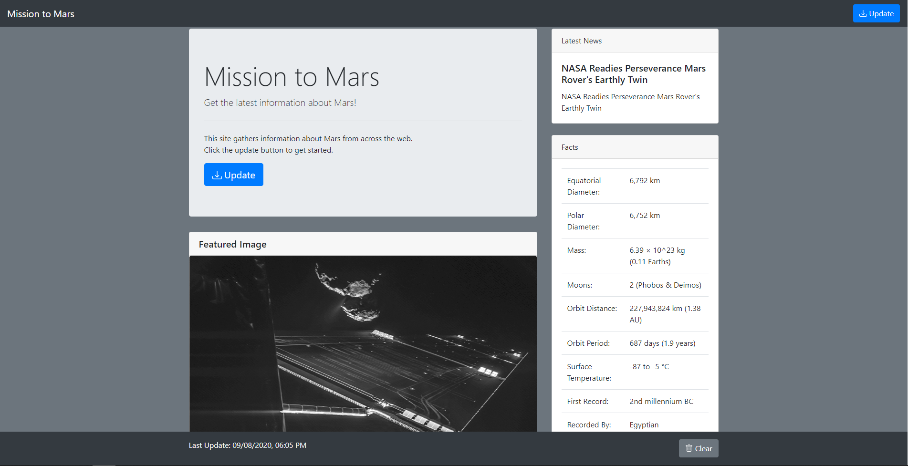
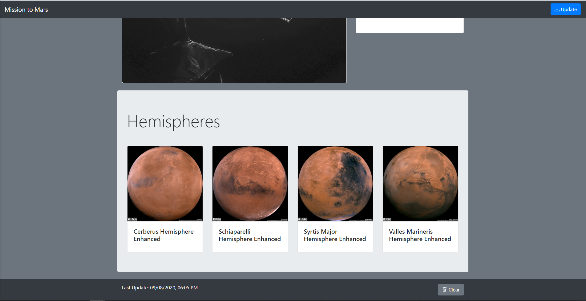

# Mission To Mars
This project is to demonstrate abilities to use web-scraping frameworks like BeautifulSoup and Splinter.

## Prerequisites
Before running any code in this repository, the following instructions <b>must</b> be followed:
<ol>
    <li>In the root directory make a copy of "config-template.py" and name it "config.py".</li>
    <li>
    Edit "config.py" to fill in the requied information:
        <ul>
            <li>chromedriver_path should be a path to a folder containing a chromedriver.exe file. For Windows, an example might be "c:/bin/chromedriver".</li>
            <li>mongo_uri should be a URI to access a mongoDB database. For a locally hosted mongoDB instance, this might be "mongodb://localhost:27017/mars_app".</li>
        </ul>
    </li>
</ol>

## Scrape
This folder contains the code that scrapes a variety of websites to gather information on Mars.
The code in this folder is used in the files contained in the Notebook and Flask folders.

## Notebook
This folder contains a Jupyter Notebook that calls the code in the Scrape folder.

### How to Run
<ol>
	  <li>In the terminal, initialize an Anaconda environment using "source activate <i>{your environment}</i>".</li>
	  <li>Open Jupyter Notebook using "jupyter notebook" in the terminal.</li>
	  <li>In the Jupyter Notebook, open the ipynb file that contains the code.</li>
	  <li>
	    With the code open, you have two options on how to run the code:
	    <ul>
	      <li>
		In the menu bar open Kernel > Restart and Clear Output.  Then you can use Shift+Enter to run the code one block at a time.
	      </li>
	      <li>In the menu bar open Kernel > Restart and Run All.  This will run all of the blocks of code at once.</li>
	    </ul>
	  </li>
</ol>

## Flask
This folder contains code for a website to display scraped information.  Due to needed configuration and a lack of a server, this can only be run locally on your computer.  Screenshots of the running application can be found in the screenshots folder.

### How to Run
<ol>
    <li>In the terminal, initialize an Anaconda environment using "source activate <i>{your environment}</i>".</li>
    <li>Navigate your terminal to the Flask folder.</li>
    <li>Run the application using the following command: "python app.py"</li>
    <li>The command should output a URL hosted on your computer to access, go to that URL in Chrome.</li>
</ol>

### Screenshots

